# Badminton Application - Database Design Document (Revised)

## 1. Overview

This document outlines the database design for the new badminton application that will be split into separate frontend and backend repositories. The database is designed to support Clerk authentication with Line OAuth, session management with location pins, match tracking, and a flexible scoring system that allows for score recalculation when formulas change.

## 2. System Architecture

- **Frontend**: Flutter application (separate repository)
- **Backend**: Node.js/Express API server (separate repository)
- **Database**: PostgreSQL with advanced features
- **Authentication**: Clerk with Line OAuth integration
- **Privacy-First**: Minimal personal data storage approach

## 3. Core Requirements

### 3.1 User Management
- Clerk-managed authentication with Line OAuth provider
- Unique player names (no duplicates allowed)
- Minimal personal data storage (privacy-first approach)
- Users can host and participate in sessions

### 3.2 Session Management
- Sessions are time-bound events (few hours long)
- Each session has a host (who is also a player)
- Sessions include location information with Google Maps integration
- Multiple players participate in each session

### 3.3 Match Management
- Players compete in doubles matches (4 players per match)
- Matches are tracked with detailed results
- Match history is preserved for scoring calculations

### 3.4 Scoring System
- Dynamic scoring system based on match history
- Support for score recalculation when formulas change
- Historical score tracking for analytics

## 4. Database Schema Design

### 4.1 Database Schema Overview

#### 4.1.1 Entity Relationship Diagram

```mermaid
erDiagram
    %% Organizations for Group Management
    ORGANIZATIONS {
        uuid id PK
        varchar name
        text description
        uuid owner_user_id FK
        boolean is_public
        boolean auto_approve_members
        integer default_session_duration_hours
        integer default_courts
        integer default_max_players
        integer member_count
        integer total_sessions
        varchar contact_email
        text website_url
        varchar default_location_name
        text default_location_address
        decimal default_location_latitude
        decimal default_location_longitude
        timestamp created_at
        timestamp updated_at
    }

    %% Organization Membership (Many-to-Many)
    ORGANIZATION_MEMBERS {
        uuid id PK
        uuid organization_id FK
        uuid user_id FK
        varchar role
        varchar status
        jsonb notification_preferences
        integer sessions_attended
        integer total_matches_in_org
        timestamp joined_at
        timestamp last_active_at
        timestamp created_at
        timestamp updated_at
    }

    %% Session Templates for Recurring Events
    SESSION_TEMPLATES {
        uuid id PK
        uuid organization_id FK
        uuid created_by_user_id FK
        varchar name
        text description
        integer duration_hours
        integer courts_available
        integer max_players
        varchar location_name
        text location_address
        decimal location_latitude
        decimal location_longitude
        text location_notes
        varchar match_format
        varchar scoring_system
        integer points_to_win
        decimal cost_per_player
        varchar currency
        boolean is_active
        boolean auto_invite_members
        boolean requires_approval
        integer times_used
        timestamp last_used_at
        timestamp created_at
        timestamp updated_at
    }

    %% Core User Management (TrueSkill)
    USERS {
        uuid id PK
        varchar clerk_id UK
        varchar email UK
        varchar oauth_provider
        varchar oauth_provider_id
        varchar player_name UK
        text avatar_url
        varchar skill_level
        integer total_matches
        integer total_wins
        integer total_losses
        decimal trueskill_mu
        decimal trueskill_sigma
        decimal trueskill_rating
        integer legacy_elo_rating
        boolean is_active
        timestamp last_match_at
        timestamp last_login_at
        timestamp created_at
        timestamp updated_at
    }

    %% Sessions (with QR/Invite Codes)
    SESSIONS {
        uuid id PK
        varchar name
        text description
        uuid organization_id FK
        uuid template_id FK
        uuid host_user_id FK
        varchar location_name
        text location_address
        decimal location_latitude
        decimal location_longitude
        text location_notes
        timestamp scheduled_start_time
        timestamp scheduled_end_time
        timestamp actual_start_time
        timestamp actual_end_time
        integer max_players
        integer courts_available
        timestamp registration_deadline
        decimal cost_per_player
        varchar currency
        varchar match_format
        varchar scoring_system
        integer points_to_win
        varchar status
        boolean is_public
        boolean requires_approval
        varchar invite_code UK
        text qr_code_data
        timestamp invite_code_expires_at
        boolean allow_code_join
        integer max_code_uses
        integer code_uses_count
        integer total_matches_played
        integer total_participants
        timestamp created_at
        timestamp updated_at
    }

    %% Session Participants (Many-to-Many)
    SESSION_PARTICIPANTS {
        uuid id PK
        uuid session_id FK
        uuid user_id FK
        timestamp joined_at
        timestamp left_at
        varchar status
        varchar payment_status
        decimal payment_amount
        text notes
        timestamp created_at
        timestamp updated_at
    }

    %% Matches
    MATCHES {
        uuid id PK
        uuid session_id FK
        integer court_number
        timestamp scheduled_start_time
        timestamp actual_start_time
        timestamp completed_at
        timestamp cancelled_at
        uuid team1_player1_id FK
        uuid team1_player2_id FK
        uuid team2_player1_id FK
        uuid team2_player2_id FK
        integer winning_team
        integer team1_score
        integer team2_score
        jsonb detailed_scores
        integer match_duration_minutes
        varchar match_type
        uuid referee_user_id FK
        varchar status
        text notes
        varchar weather_conditions
        timestamp created_at
        timestamp updated_at
    }

    %% TrueSkill Rating History
    RATING_HISTORY {
        uuid id PK
        uuid user_id FK
        uuid match_id FK
        uuid session_id FK
        decimal mu_before
        decimal mu_after
        decimal sigma_before
        decimal sigma_after
        decimal rating_before
        decimal rating_after
        boolean was_winner
        decimal match_quality
        decimal player_team_mu
        decimal player_team_sigma
        decimal opponent_team_mu
        decimal opponent_team_sigma
        decimal beta
        decimal tau
        varchar formula_version
        timestamp calculation_timestamp
        text notes
        timestamp created_at
    }

    %% Rating Formulas for Flexibility
    RATING_FORMULAS {
        uuid id PK
        varchar version UK
        varchar name
        text description
        jsonb parameters
        boolean is_active
        timestamp effective_from
        timestamp effective_until
        uuid created_by FK
        timestamp created_at
    }


    %% Match Events for Detailed Tracking
    MATCH_EVENTS {
        uuid id PK
        uuid match_id FK
        varchar event_type
        jsonb event_data
        timestamp event_timestamp
        uuid user_id FK
        uuid recorded_by FK
        integer sequence_number
        text notes
        timestamp created_at
    }

    %% Session Invite Logs for QR/Code Analytics
    SESSION_INVITE_LOGS {
        uuid id PK
        uuid session_id FK
        uuid user_id FK
        varchar join_method
        varchar invite_code_used
        inet ip_address
        text user_agent
        text referrer
        timestamp attempted_at
        boolean success
        varchar failure_reason
        text notes
    }

    %% User Sessions for Authentication
    USER_SESSIONS {
        uuid id PK
        uuid user_id FK
        varchar session_token UK
        varchar refresh_token UK
        inet ip_address
        text user_agent
        jsonb device_info
        timestamp created_at
        timestamp expires_at
        timestamp last_accessed_at
        boolean is_active
        timestamp revoked_at
        varchar revoked_reason
    }

    %% Relationships
    
    %% Organization relationships
    USERS ||--o{ ORGANIZATIONS : "owns"
    ORGANIZATIONS ||--o{ ORGANIZATION_MEMBERS : "has_members"
    USERS ||--o{ ORGANIZATION_MEMBERS : "member_of"
    ORGANIZATIONS ||--o{ SESSION_TEMPLATES : "has_templates"
    ORGANIZATIONS ||--o{ SESSIONS : "hosts_sessions"
    
    %% Template relationships
    USERS ||--o{ SESSION_TEMPLATES : "creates"
    SESSION_TEMPLATES ||--o{ SESSIONS : "generates"
    
    %% Core session relationships
    USERS ||--o{ SESSIONS : "hosts"
    USERS ||--o{ SESSION_PARTICIPANTS : "participates"
    SESSIONS ||--o{ SESSION_PARTICIPANTS : "has_participants"
    SESSIONS ||--o{ MATCHES : "contains"
    SESSIONS ||--o{ RATING_HISTORY : "generates"
    SESSIONS ||--o{ SESSION_INVITE_LOGS : "tracks_joins"
    USERS ||--o{ SESSION_INVITE_LOGS : "joins_via_code"
    
    %% Match and rating relationships
    MATCHES ||--o{ RATING_HISTORY : "affects_ratings"
    MATCHES ||--o{ MATCH_EVENTS : "has_events"
    USERS ||--o{ RATING_HISTORY : "has_history"
    USERS ||--o{ USER_SESSIONS : "has_sessions"
    USERS ||--o{ RATING_FORMULAS : "creates"
    USERS ||--o{ MATCH_EVENTS : "records"
    
    %% Player-Match relationships (4 players per match)
    USERS ||--o{ MATCHES : "team1_player1"
    USERS ||--o{ MATCHES : "team1_player2"
    USERS ||--o{ MATCHES : "team2_player1"
    USERS ||--o{ MATCHES : "team2_player2"
    USERS ||--o{ MATCHES : "referees"
```



#### 4.1.2 Database Schema Visual (ASCII)

```
┌─────────────────────────────────────────────────────────────────────────────────┐
│                    BADMINTON APPLICATION DATABASE (ENHANCED)                    │
└─────────────────────────────────────────────────────────────────────────────────┘

                           ┌─────────────────┐
                           │ ORGANIZATIONS   │ ◄── Group Management
                           ├─────────────────┤
                           │ id (PK)         │
                           │ name            │
                           │ owner_user_id   │──┐
                           │ is_public       │  │
                           │ member_count    │  │
                           │ default_location│  │
                           └─────────┬───────┘  │
                                    │          │
                                    ▼          │
                    ┌─────────────────────────┐ │    ┌─────────────────┐
                    │ SESSION_TEMPLATES       │ │    │     USERS       │
                    ├─────────────────────────┤ │    ├─────────────────┤
                    │ id (PK)                 │ │    │ id (PK)         │ ◄──┘
                    │ organization_id (FK)    │─┘    │ email           │
                    │ name                    │      │ oauth_provider  │
                    │ duration_hours          │      │ player_name (UK)│
                    │ courts_available        │      │ skill_level     │
                    │ times_used              │      │ current_rating  │
                    └─────────┬───────────────┘      │ total_matches   │
                             │                      │ is_active       │
                             ▼                      └─────────┬───────┘
┌─────────────────┐    ┌─────────────────┐    ┌─────────────────┐    │
│ ORGANIZATION_   │    │    SESSIONS     │    │     MATCHES     │    │
│ MEMBERS         │    ├─────────────────┤    ├─────────────────┤    │
├─────────────────┤    │ id (PK)         │    │ id (PK)         │    │
│ id (PK)         │    │ organization_id │──┐ │ session_id (FK) │────┘
│ organization_id │────┤ template_id (FK)│  │ │ court_number    │
│ user_id (FK)    │──┐ │ host_user_id(FK)│──┼─│ team1_player1_id│──┐
│ role            │  │ │ name            │  │ │ team1_player2_id│──┼──┐
│ status          │  │ │ location_name   │  │ │ team2_player1_id│──┼──┼──┐
│ sessions_attended│  │ │ scheduled_start │  │ │ team2_player2_id│──┼──┼──┼──┐
└─────────────────┘  │ │ max_players     │  │ │ winning_team    │  │  │  │  │
                     │ │ status          │  │ │ status          │  │  │  │  │
                     │ └─────────────────┘  │ └─────────────────┘  │  │  │  │
                     │                      │                     │  │  │  │
                     │  ┌─────────────────┐ │                     │  │  │  │
                     │  │SESSION_PARTICIPANTS ◄ Simplified       │  │  │  │
                     │  ├─────────────────┤ │                     │  │  │  │
                     │  │ id (PK)         │ │                     │  │  │  │
                     │  │ session_id (FK) │─┘                     │  │  │  │
                     └──│ user_id (FK)    │                       │  │  │  │
                        │ joined_at       │                       │  │  │  │
                        │ status          │ ◄ No session stats    │  │  │  │
                        │ payment_status  │   (calculated from    │  │  │  │
                        └─────────────────┘    matches table)     │  │  │  │
                                                                  │  │  │  │
         ┌────────────────────────────────────────────────────────┘  │  │  │
         └───────────────────────────────────────────────────────────┘  │  │
                                                                       │  │
                                                                       │  │
┌─────────────────┐    ┌─────────────────┐                              │  │
│ RATING_HISTORY  │    │ RATING_FORMULAS │                              │  │
├─────────────────┤    ├─────────────────┤                              │  │
│ id (PK)         │    │ id (PK)         │                              │  │
│ user_id (FK)    │────┤ version (UK)    │                              │  │
│ match_id (FK)   │    │ name            │                              │  │
│ rating_before   │    │ is_active       │                              │  │
│ rating_after    │    │ created_by (FK) │──────────────────────────────┘  │
│ was_winner      │    └─────────────────┘                                 │
│ formula_version │                                                        │
└─────────────────┘         ┌──────────────────────────────────────────────┘
                            └─────────────────────────────────────────────
```

#### 4.1.3 Key Relationships Summary

**Primary Relationships:**
- **Organizations ↔ Users**: One-to-Many (Users own organizations)
- **Organizations ↔ Organization Members**: One-to-Many (Members belong to organizations)
- **Organizations ↔ Session Templates**: One-to-Many (Templates belong to organizations)
- **Session Templates ↔ Sessions**: One-to-Many (Templates generate sessions)
- **Users ↔ Sessions**: One-to-Many (User hosts multiple sessions)
- **Users ↔ Session Participants**: Many-to-Many (Users participate in multiple sessions)
- **Sessions ↔ Matches**: One-to-Many (Session contains multiple matches)
- **Users ↔ Matches**: Complex (4 users per match as players + optional referee)
- **Matches ↔ Rating History**: One-to-Many (Each match generates rating changes)

**Supporting Relationships:**
- **Users ↔ User Sessions**: One-to-Many (Authentication sessions)
- **Matches ↔ Match Events**: One-to-Many (Event tracking)
- **Users ↔ Rating Formulas**: One-to-Many (Formula creation)

**New Benefits:**
- **Group Management**: Hosts can manage multiple badminton groups/clubs
- **Template System**: Create recurring sessions with one click
- **Member Management**: Easy invitation and role management
- **Simplified Tracking**: Session statistics calculated from matches table
- **Flexible Court Management**: Simple court count tracking without unnecessary detail tables

#### 4.1.4 Data Flow Visualization

```
┌─────────────┐   Clerk + Line   ┌─────────────┐
│    Clerk    │ ──────────────► │    USERS    │
│  (Line OAuth)│                  │             │
└─────────────┘                  └──────┬──────┘
                                        │
                                        ▼
                              ┌─────────────────┐
                              │ ORGANIZATIONS   │ ◄── Host creates group
                              │                 │
                              └──────┬──────────┘
                                     │
                                     ▼
                         ┌─────────────────────┐
                         │ORGANIZATION_MEMBERS │ ◄── Invite regular players
                         │                     │
                         └──────────┬──────────┘
                                    │
                                    ▼
                         ┌─────────────────────┐
                         │ SESSION_TEMPLATES   │ ◄── Create reusable templates
                         │                     │
                         └──────────┬──────────┘
                                    │
                                    ▼
                            ┌─────────────┐
                            │  SESSIONS   │ ◄── Generate from template
                            │             │     or create new
                            └──────┬──────┘
                                   │
                                   ▼
                       ┌─────────────────────┐
                       │ SESSION_PARTICIPANTS│ ◄── Members join automatically
                       │    (Simplified)     │     or manually
                       └──────────┬──────────┘
                                  │
                                  ▼
                          ┌─────────────┐
                          │   MATCHES   │ ◄── Matches created & played
                          │             │
                          └──────┬──────┘
                                 │ Match completed
                                 ▼
                         ┌─────────────────┐
                         │ RATING_HISTORY  │ ◄── Ratings updated
                         │                 │     Statistics calculated
                         └─────────────────┘     from matches table
```

### 4.2 Core Tables

#### 4.2.1 Organizations Table (Group Management)
```sql
CREATE TABLE organizations (
    id UUID PRIMARY KEY DEFAULT uuid_generate_v4(),
    name VARCHAR(200) NOT NULL,
    description TEXT,
    
    -- Organization ownership and management
    owner_user_id UUID NOT NULL REFERENCES users(id),
    
    -- Organization settings
    is_public BOOLEAN DEFAULT FALSE,
    auto_approve_members BOOLEAN DEFAULT TRUE,
    default_session_duration_hours INTEGER DEFAULT 3,
    default_courts INTEGER DEFAULT 2,
    default_max_players INTEGER DEFAULT 16,
    
    -- Statistics
    member_count INTEGER DEFAULT 0,
    total_sessions INTEGER DEFAULT 0,
    
    -- Contact and location
    contact_email VARCHAR(255),
    website_url TEXT,
    default_location_name VARCHAR(200),
    default_location_address TEXT,
    default_location_latitude DECIMAL(10, 8),
    default_location_longitude DECIMAL(11, 8),
    
    -- Timestamps
    created_at TIMESTAMP WITH TIME ZONE DEFAULT NOW(),
    updated_at TIMESTAMP WITH TIME ZONE DEFAULT NOW(),
    
    -- Constraints
    CONSTRAINT positive_stats CHECK (member_count >= 0 AND total_sessions >= 0),
    CONSTRAINT valid_defaults CHECK (
        default_session_duration_hours > 0 AND default_session_duration_hours <= 12 AND
        default_courts > 0 AND default_courts <= 20 AND
        default_max_players > 0 AND default_max_players <= 100
    ),
    CONSTRAINT valid_coordinates CHECK (
        (default_location_latitude IS NULL AND default_location_longitude IS NULL) OR 
        (default_location_latitude BETWEEN -90 AND 90 AND default_location_longitude BETWEEN -180 AND 180)
    )
);
```

#### 4.2.2 Organization Members Table (Many-to-Many)
```sql
CREATE TABLE organization_members (
    id UUID PRIMARY KEY DEFAULT uuid_generate_v4(),
    organization_id UUID NOT NULL REFERENCES organizations(id) ON DELETE CASCADE,
    user_id UUID NOT NULL REFERENCES users(id) ON DELETE CASCADE,
    
    -- Member role and status
    role VARCHAR(20) DEFAULT 'member' CHECK (role IN ('owner', 'admin', 'member')),
    status VARCHAR(20) DEFAULT 'active' CHECK (status IN ('pending', 'active', 'inactive', 'banned')),
    
    -- Member preferences for this organization
    notification_preferences JSONB DEFAULT '{"sessions": true, "matches": true, "ratings": false}',
    
    -- Member statistics within this organization
    sessions_attended INTEGER DEFAULT 0,
    total_matches_in_org INTEGER DEFAULT 0,
    
    -- Membership timing
    joined_at TIMESTAMP WITH TIME ZONE DEFAULT NOW(),
    last_active_at TIMESTAMP WITH TIME ZONE,
    
    -- Timestamps
    created_at TIMESTAMP WITH TIME ZONE DEFAULT NOW(),
    updated_at TIMESTAMP WITH TIME ZONE DEFAULT NOW(),
    
    -- Constraints
    UNIQUE(organization_id, user_id),
    CONSTRAINT positive_org_stats CHECK (
        sessions_attended >= 0 AND total_matches_in_org >= 0
    )
);
```

#### 4.2.3 Session Templates Table (Recurring Sessions)
```sql
CREATE TABLE session_templates (
    id UUID PRIMARY KEY DEFAULT uuid_generate_v4(),
    organization_id UUID REFERENCES organizations(id) ON DELETE CASCADE,
    created_by_user_id UUID NOT NULL REFERENCES users(id),
    
    -- Template identification
    name VARCHAR(200) NOT NULL,
    description TEXT,
    
    -- Default session settings
    duration_hours INTEGER DEFAULT 3,
    courts_available INTEGER DEFAULT 2,
    max_players INTEGER DEFAULT 16,
    
    -- Default location (can override organization defaults)
    location_name VARCHAR(200),
    location_address TEXT,
    location_latitude DECIMAL(10, 8),
    location_longitude DECIMAL(11, 8),
    location_notes TEXT,
    
    -- Game settings
    match_format VARCHAR(20) DEFAULT 'doubles',
    scoring_system VARCHAR(20) DEFAULT 'rally_point',
    points_to_win INTEGER DEFAULT 21,
    
    -- Pricing template
    cost_per_player DECIMAL(10, 2),
    currency VARCHAR(3) DEFAULT 'USD',
    
    -- Template settings
    is_active BOOLEAN DEFAULT TRUE,
    auto_invite_members BOOLEAN DEFAULT FALSE,
    requires_approval BOOLEAN DEFAULT FALSE,
    
    -- Usage statistics
    times_used INTEGER DEFAULT 0,
    last_used_at TIMESTAMP WITH TIME ZONE,
    
    -- Timestamps
    created_at TIMESTAMP WITH TIME ZONE DEFAULT NOW(),
    updated_at TIMESTAMP WITH TIME ZONE DEFAULT NOW(),
    
    -- Constraints
    CONSTRAINT positive_template_settings CHECK (
        duration_hours > 0 AND duration_hours <= 12 AND
        courts_available > 0 AND courts_available <= 20 AND
        max_players > 0 AND max_players <= 100 AND
        times_used >= 0
    ),
    CONSTRAINT valid_template_coordinates CHECK (
        (location_latitude IS NULL AND location_longitude IS NULL) OR 
        (location_latitude BETWEEN -90 AND 90 AND location_longitude BETWEEN -180 AND 180)
    )
);
```

#### 4.2.4 Users Table (Merged User/Player Model)
```sql
CREATE TABLE users (
    id UUID PRIMARY KEY DEFAULT uuid_generate_v4(),
    
    -- Clerk Authentication
    clerk_id VARCHAR(255) UNIQUE NOT NULL, -- Clerk user ID
    email VARCHAR(255) UNIQUE, -- Optional, from Clerk/Line
    oauth_provider VARCHAR(50) NOT NULL DEFAULT 'line', -- 'line' for Line OAuth
    oauth_provider_id VARCHAR(255) NOT NULL, -- Line user ID
    clerk_created_at TIMESTAMP WITH TIME ZONE, -- When user was created in Clerk
    
    -- Player Identity (unique across platform)
    player_name VARCHAR(50) UNIQUE NOT NULL, -- Unique display name
    
    -- Profile Information (minimal)
    avatar_url TEXT, -- From Line profile or custom upload
    skill_level VARCHAR(2) CHECK (skill_level IN ('F', 'BG', 'N', 'S', 'P')),
    
    -- Game Statistics
    total_matches INTEGER DEFAULT 0,
    total_wins INTEGER DEFAULT 0,
    total_losses INTEGER DEFAULT 0,
    
    -- TrueSkill Rating System
    trueskill_mu DECIMAL(8,4) DEFAULT 25.0,      -- Skill mean (μ) - estimated skill level
    trueskill_sigma DECIMAL(8,4) DEFAULT 8.333,  -- Skill uncertainty (σ) - confidence in estimate
    trueskill_rating DECIMAL(8,4) DEFAULT 0.0,   -- Conservative rating (μ - 3*σ) for display
    
    -- Legacy ELO (for migration/comparison)
    legacy_elo_rating INTEGER DEFAULT 1200,
    
    -- Account Status
    is_active BOOLEAN DEFAULT TRUE,
    last_match_at TIMESTAMP WITH TIME ZONE,
    last_login_at TIMESTAMP WITH TIME ZONE,
    
    -- Timestamps
    created_at TIMESTAMP WITH TIME ZONE DEFAULT NOW(),
    updated_at TIMESTAMP WITH TIME ZONE DEFAULT NOW(),
    
    -- Constraints
    UNIQUE(clerk_id), -- Prevent duplicate Clerk accounts
    UNIQUE(oauth_provider, oauth_provider_id), -- Prevent duplicate OAuth accounts
    CONSTRAINT positive_stats CHECK (
        total_matches >= 0 AND 
        total_wins >= 0 AND 
        total_losses >= 0 AND
        total_wins + total_losses <= total_matches
    ),
    CONSTRAINT valid_trueskill CHECK (
        trueskill_mu >= 0 AND trueskill_mu <= 100 AND
        trueskill_sigma >= 0.1 AND trueskill_sigma <= 25 AND
        trueskill_rating >= -50 AND trueskill_rating <= 100
    ),
    CONSTRAINT valid_legacy_elo CHECK (legacy_elo_rating >= 0 AND legacy_elo_rating <= 5000),
    CONSTRAINT valid_player_name CHECK (LENGTH(player_name) >= 2 AND LENGTH(player_name) <= 50)
);
```

#### 4.2.2 Sessions Table
```sql
CREATE TABLE sessions (
    id UUID PRIMARY KEY DEFAULT uuid_generate_v4(),
    name VARCHAR(200) NOT NULL,
    description TEXT,
    
    -- Organization and template relationships
    organization_id UUID REFERENCES organizations(id),
    template_id UUID REFERENCES session_templates(id),
    
    -- Host (who is also a player)
    host_user_id UUID NOT NULL REFERENCES users(id),
    
    -- Location Information (Google Maps integration)
    location_name VARCHAR(200), -- e.g., "Downtown Sports Center"
    location_address TEXT, -- Full address
    location_latitude DECIMAL(10, 8), -- For Google Maps pin
    location_longitude DECIMAL(11, 8), -- For Google Maps pin
    location_notes TEXT, -- Additional location details
    
    -- Session timing
    scheduled_start_time TIMESTAMP WITH TIME ZONE NOT NULL,
    scheduled_end_time TIMESTAMP WITH TIME ZONE NOT NULL,
    actual_start_time TIMESTAMP WITH TIME ZONE,
    actual_end_time TIMESTAMP WITH TIME ZONE,
    
    -- Session configuration
    max_players INTEGER DEFAULT 20,
    courts_available INTEGER NOT NULL DEFAULT 1,
    registration_deadline TIMESTAMP WITH TIME ZONE,
    
    -- Pricing (optional)
    cost_per_player DECIMAL(10, 2),
    currency VARCHAR(3) DEFAULT 'USD',
    
    -- Session rules and settings
    match_format VARCHAR(20) DEFAULT 'doubles' CHECK (match_format IN ('singles', 'doubles', 'mixed')),
    scoring_system VARCHAR(20) DEFAULT 'rally_point' CHECK (scoring_system IN ('rally_point', 'traditional')),
    points_to_win INTEGER DEFAULT 21,
    
    -- Session status
    status VARCHAR(20) DEFAULT 'scheduled' CHECK (status IN ('scheduled', 'active', 'completed', 'cancelled')),
    is_public BOOLEAN DEFAULT TRUE,
    requires_approval BOOLEAN DEFAULT FALSE,
    
    -- Join codes for QR/invite functionality
    invite_code VARCHAR(8) UNIQUE, -- Short code like "ABC123"
    qr_code_data TEXT, -- Full URL or data for QR code
    invite_code_expires_at TIMESTAMP WITH TIME ZONE,
    allow_code_join BOOLEAN DEFAULT TRUE,
    max_code_uses INTEGER, -- Optional limit on code usage
    code_uses_count INTEGER DEFAULT 0,
    
    -- Statistics
    total_matches_played INTEGER DEFAULT 0,
    total_participants INTEGER DEFAULT 0,
    
    -- Timestamps
    created_at TIMESTAMP WITH TIME ZONE DEFAULT NOW(),
    updated_at TIMESTAMP WITH TIME ZONE DEFAULT NOW(),
    
    -- Constraints
    CONSTRAINT valid_timing CHECK (scheduled_end_time > scheduled_start_time),
    CONSTRAINT valid_courts CHECK (courts_available > 0 AND courts_available <= 20),
    CONSTRAINT valid_players CHECK (max_players > 0 AND max_players <= 100),
    CONSTRAINT valid_cost CHECK (cost_per_player IS NULL OR cost_per_player >= 0),
    CONSTRAINT positive_stats CHECK (total_matches_played >= 0 AND total_participants >= 0),
    CONSTRAINT valid_coordinates CHECK (
        (location_latitude IS NULL AND location_longitude IS NULL) OR 
        (location_latitude BETWEEN -90 AND 90 AND location_longitude BETWEEN -180 AND 180)
    ),
    CONSTRAINT valid_invite_code CHECK (
        invite_code IS NULL OR 
        (LENGTH(invite_code) >= 4 AND LENGTH(invite_code) <= 8 AND invite_code ~ '^[A-Z0-9]+$')
    ),
    CONSTRAINT valid_code_usage CHECK (
        code_uses_count >= 0 AND 
        (max_code_uses IS NULL OR code_uses_count <= max_code_uses)
    )
);
```

#### 4.2.3 Session Participants Table
```sql
CREATE TABLE session_participants (
    id UUID PRIMARY KEY DEFAULT uuid_generate_v4(),
    session_id UUID NOT NULL REFERENCES sessions(id) ON DELETE CASCADE,
    user_id UUID NOT NULL REFERENCES users(id) ON DELETE CASCADE,
    
    -- Participation details
    joined_at TIMESTAMP WITH TIME ZONE DEFAULT NOW(),
    left_at TIMESTAMP WITH TIME ZONE,
    status VARCHAR(20) DEFAULT 'registered' CHECK (status IN ('registered', 'confirmed', 'attended', 'no_show', 'cancelled')),
    
    -- Session statistics are calculated from matches table
    
    -- Payment status (if applicable)
    payment_status VARCHAR(20) DEFAULT 'pending' CHECK (payment_status IN ('pending', 'paid', 'refunded', 'waived')),
    payment_amount DECIMAL(10, 2),
    
    -- Notes
    notes TEXT,
    
    -- Timestamps
    created_at TIMESTAMP WITH TIME ZONE DEFAULT NOW(),
    updated_at TIMESTAMP WITH TIME ZONE DEFAULT NOW(),
    
    -- Constraints
    UNIQUE(session_id, user_id),
    CONSTRAINT valid_payment CHECK (payment_amount IS NULL OR payment_amount >= 0)
);
```

#### 4.2.4 Matches Table
```sql
CREATE TABLE matches (
    id UUID PRIMARY KEY DEFAULT uuid_generate_v4(),
    session_id UUID NOT NULL REFERENCES sessions(id) ON DELETE CASCADE,
    court_number INTEGER NOT NULL,
    
    -- Match timing
    scheduled_start_time TIMESTAMP WITH TIME ZONE,
    actual_start_time TIMESTAMP WITH TIME ZONE DEFAULT NOW(),
    completed_at TIMESTAMP WITH TIME ZONE,
    cancelled_at TIMESTAMP WITH TIME ZONE,
    
    -- Team composition (doubles)
    team1_player1_id UUID NOT NULL REFERENCES users(id),
    team1_player2_id UUID NOT NULL REFERENCES users(id),
    team2_player1_id UUID NOT NULL REFERENCES users(id),
    team2_player2_id UUID NOT NULL REFERENCES users(id),
    
    -- Match results
    winning_team INTEGER CHECK (winning_team IN (1, 2)),
    team1_score INTEGER CHECK (team1_score >= 0),
    team2_score INTEGER CHECK (team2_score >= 0),
    
    -- Detailed scoring (for games within match)
    detailed_scores JSONB, -- Store game-by-game scores
    
    -- Match metadata
    match_duration_minutes INTEGER,
    match_type VARCHAR(20) DEFAULT 'doubles',
    referee_user_id UUID REFERENCES users(id),
    
    -- Match status
    status VARCHAR(20) DEFAULT 'scheduled' CHECK (status IN ('scheduled', 'in_progress', 'completed', 'cancelled')),
    
    -- Notes and context
    notes TEXT,
    weather_conditions VARCHAR(100), -- for outdoor courts
    
    -- Timestamps
    created_at TIMESTAMP WITH TIME ZONE DEFAULT NOW(),
    updated_at TIMESTAMP WITH TIME ZONE DEFAULT NOW(),
    
    -- Constraints
    CONSTRAINT different_players CHECK (
        team1_player1_id != team1_player2_id AND
        team1_player1_id != team2_player1_id AND
        team1_player1_id != team2_player2_id AND
        team1_player2_id != team2_player1_id AND
        team1_player2_id != team2_player2_id AND
        team2_player1_id != team2_player2_id
    ),
    CONSTRAINT match_completion_logic CHECK (
        (status = 'completed' AND completed_at IS NOT NULL AND winning_team IS NOT NULL) OR
        (status = 'cancelled' AND cancelled_at IS NOT NULL) OR
        (status IN ('scheduled', 'in_progress'))
    ),
    CONSTRAINT positive_court CHECK (court_number > 0)
);
```

### 4.3 Scoring and Analytics Tables

#### 4.3.1 Rating History Table (TrueSkill)
```sql
CREATE TABLE rating_history (
    id UUID PRIMARY KEY DEFAULT uuid_generate_v4(),
    user_id UUID NOT NULL REFERENCES users(id) ON DELETE CASCADE,
    match_id UUID REFERENCES matches(id) ON DELETE CASCADE,
    session_id UUID NOT NULL REFERENCES sessions(id) ON DELETE CASCADE,
    
    -- TrueSkill rating changes
    mu_before DECIMAL(8,4) NOT NULL,           -- Previous skill mean
    mu_after DECIMAL(8,4) NOT NULL,            -- New skill mean
    sigma_before DECIMAL(8,4) NOT NULL,        -- Previous uncertainty
    sigma_after DECIMAL(8,4) NOT NULL,         -- New uncertainty
    rating_before DECIMAL(8,4) NOT NULL,       -- Previous conservative rating
    rating_after DECIMAL(8,4) NOT NULL,        -- New conservative rating
    
    -- Match context for TrueSkill calculation
    was_winner BOOLEAN NOT NULL,
    match_quality DECIMAL(6,4),                -- TrueSkill match quality (0-1)
    
    -- Team composition for doubles
    player_team_mu DECIMAL(8,4) NOT NULL,      -- Player's team combined μ
    player_team_sigma DECIMAL(8,4) NOT NULL,   -- Player's team combined σ
    opponent_team_mu DECIMAL(8,4) NOT NULL,    -- Opponent team combined μ
    opponent_team_sigma DECIMAL(8,4) NOT NULL, -- Opponent team combined σ
    
    -- TrueSkill calculation metadata
    beta DECIMAL(6,4) DEFAULT 4.166,           -- Skill class width (σ/2)
    tau DECIMAL(6,4) DEFAULT 0.083,            -- Dynamics factor
    draw_probability DECIMAL(4,3) DEFAULT 0.0, -- Probability of draw (0 for badminton)
    
    -- Formula versioning for recalculation
    formula_version VARCHAR(20) DEFAULT 'trueskill_1.0',
    calculation_timestamp TIMESTAMP WITH TIME ZONE DEFAULT NOW(),
    
    -- Additional context
    notes TEXT,
    
    -- Timestamps
    created_at TIMESTAMP WITH TIME ZONE DEFAULT NOW(),
    
    -- Constraints
    CONSTRAINT valid_mu_change CHECK (
        mu_before >= 0 AND mu_after >= 0 AND
        mu_before <= 100 AND mu_after <= 100
    ),
    CONSTRAINT valid_sigma_values CHECK (
        sigma_before >= 0.1 AND sigma_after >= 0.1 AND
        sigma_before <= 25 AND sigma_after <= 25 AND
        sigma_after <= sigma_before -- Uncertainty should generally decrease
    ),
    CONSTRAINT valid_match_quality CHECK (match_quality IS NULL OR (match_quality >= 0.0 AND match_quality <= 1.0)),
    CONSTRAINT valid_team_ratings CHECK (
        player_team_mu >= 0 AND opponent_team_mu >= 0 AND
        player_team_sigma >= 0.1 AND opponent_team_sigma >= 0.1
    )
);
```

#### 4.3.2 Rating Formulas Table (TrueSkill)
```sql
CREATE TABLE rating_formulas (
    id UUID PRIMARY KEY DEFAULT uuid_generate_v4(),
    version VARCHAR(20) UNIQUE NOT NULL,
    name VARCHAR(100) NOT NULL,
    description TEXT,
    algorithm VARCHAR(20) DEFAULT 'trueskill' CHECK (algorithm IN ('trueskill', 'elo', 'glicko')),
    
    -- TrueSkill parameters (stored as JSON for flexibility)
    parameters JSONB NOT NULL DEFAULT '{
        "initial_mu": 25.0,
        "initial_sigma": 8.333,
        "beta": 4.166,
        "tau": 0.083,
        "draw_probability": 0.0
    }',
    
    -- Formula metadata
    is_active BOOLEAN DEFAULT FALSE,
    effective_from TIMESTAMP WITH TIME ZONE DEFAULT NOW(),
    effective_until TIMESTAMP WITH TIME ZONE,
    
    -- Versioning
    created_by UUID REFERENCES users(id),
    created_at TIMESTAMP WITH TIME ZONE DEFAULT NOW(),
    
    -- Constraints
    CONSTRAINT single_active_formula CHECK (
        NOT is_active OR 
        (SELECT COUNT(*) FROM rating_formulas WHERE is_active = TRUE AND id != rating_formulas.id) = 0
    )
);
```

### 4.4 Supporting Tables

#### 4.4.1 Match Events Table
```sql
CREATE TABLE match_events (
    id UUID PRIMARY KEY DEFAULT uuid_generate_v4(),
    match_id UUID NOT NULL REFERENCES matches(id) ON DELETE CASCADE,
    
    -- Event details
    event_type VARCHAR(50) NOT NULL,
    event_data JSONB,
    event_timestamp TIMESTAMP WITH TIME ZONE DEFAULT NOW(),
    
    -- Event context
    user_id UUID REFERENCES users(id),
    recorded_by UUID REFERENCES users(id),
    
    -- Event metadata
    sequence_number INTEGER,
    notes TEXT,
    
    -- Timestamps
    created_at TIMESTAMP WITH TIME ZONE DEFAULT NOW()
);
```

#### 4.4.2 Session Invite Logs Table
```sql
CREATE TABLE session_invite_logs (
    id UUID PRIMARY KEY DEFAULT uuid_generate_v4(),
    session_id UUID NOT NULL REFERENCES sessions(id) ON DELETE CASCADE,
    user_id UUID REFERENCES users(id) ON DELETE SET NULL,
    
    -- Join method tracking
    join_method VARCHAR(20) NOT NULL CHECK (join_method IN ('invite_code', 'qr_code', 'direct_link', 'manual_add')),
    invite_code_used VARCHAR(8),
    
    -- Request details
    ip_address INET,
    user_agent TEXT,
    referrer TEXT,
    
    -- Join attempt details
    attempted_at TIMESTAMP WITH TIME ZONE DEFAULT NOW(),
    success BOOLEAN DEFAULT TRUE,
    failure_reason VARCHAR(100), -- 'code_expired', 'code_invalid', 'session_full', etc.
    
    -- Metadata
    notes TEXT,
    
    CONSTRAINT valid_code_match CHECK (
        (join_method IN ('invite_code', 'qr_code') AND invite_code_used IS NOT NULL) OR
        (join_method NOT IN ('invite_code', 'qr_code'))
    )
);
```

#### 4.4.3 User Sessions Table (Authentication)
```sql
CREATE TABLE user_sessions (
    id UUID PRIMARY KEY DEFAULT uuid_generate_v4(),
    user_id UUID NOT NULL REFERENCES users(id) ON DELETE CASCADE,
    
    -- Session details
    session_token VARCHAR(255) UNIQUE NOT NULL,
    refresh_token VARCHAR(255) UNIQUE,
    
    -- Session metadata
    ip_address INET,
    user_agent TEXT,
    device_info JSONB,
    
    -- Session timing
    created_at TIMESTAMP WITH TIME ZONE DEFAULT NOW(),
    expires_at TIMESTAMP WITH TIME ZONE NOT NULL,
    last_accessed_at TIMESTAMP WITH TIME ZONE DEFAULT NOW(),
    
    -- Session status
    is_active BOOLEAN DEFAULT TRUE,
    revoked_at TIMESTAMP WITH TIME ZONE,
    revoked_reason VARCHAR(100)
);
```

#### 4.4.4 FCM Tokens Table (Push Notifications)
```sql
CREATE TABLE fcm_tokens (
    id UUID PRIMARY KEY DEFAULT uuid_generate_v4(),
    user_id UUID NOT NULL REFERENCES users(id) ON DELETE CASCADE,
    
    -- FCM token
    token TEXT NOT NULL UNIQUE,
    
    -- Device information
    device_type VARCHAR(20) CHECK (device_type IN ('ios', 'android', 'web')),
    device_id VARCHAR(255),
    device_name TEXT,
    
    -- Token metadata
    is_active BOOLEAN DEFAULT TRUE,
    last_used_at TIMESTAMP WITH TIME ZONE DEFAULT NOW(),
    
    -- Timestamps
    created_at TIMESTAMP WITH TIME ZONE DEFAULT NOW(),
    updated_at TIMESTAMP WITH TIME ZONE DEFAULT NOW(),
    
    -- Constraints
    CONSTRAINT unique_user_device UNIQUE(user_id, device_id)
);

CREATE INDEX idx_fcm_tokens_user ON fcm_tokens(user_id);
CREATE INDEX idx_fcm_tokens_active ON fcm_tokens(is_active) WHERE is_active = TRUE;
CREATE INDEX idx_fcm_tokens_token ON fcm_tokens(token);
```

## 5. Clerk Authentication & Privacy Design

### 5.1 Clerk with Line OAuth Integration

#### 5.1.1 Authentication Flow
- **Clerk**: Managed authentication service handling OAuth flow
- **Line OAuth**: Social login provider for Asian markets
- **Extensible**: Easy to add more providers through Clerk (Google, GitHub, Facebook, Apple)

#### 5.1.2 Clerk Configuration
```typescript
// Backend: Clerk SDK configuration
import { clerkClient } from '@clerk/clerk-sdk-node';

export const clerk = clerkClient({
  secretKey: process.env.CLERK_SECRET_KEY,
});

// Frontend: Flutter Clerk initialization
await Clerk.instance.initialize(
  publishableKey: 'pk_test_YOUR_CLERK_KEY',
);

// Sign in with Line
await Clerk.instance.signIn(
  strategy: Strategy.oauthCustomLine,
);
```

### 5.2 Privacy-First Data Handling

#### 5.2.1 Minimal Data Collection
**What we store:**
- Clerk ID (required for authentication)
- Line user ID (OAuth provider ID)
- Email (optional, for notifications)
- Player name (unique, user-chosen)
- Avatar URL (from Line profile or custom)
- Game statistics (core app functionality)

**What we DON'T store:**
- First/last names (not needed for badminton app)
- Date of birth (privacy concern)
- Phone numbers (not required)
- Personal bio/description (privacy-first approach)
- OAuth access tokens (Clerk handles token management)

#### 5.2.2 Unique Player Name Handling
```sql
-- Function to generate unique player name
CREATE OR REPLACE FUNCTION generate_unique_player_name(base_name VARCHAR(50))
RETURNS VARCHAR(50) AS $$
DECLARE
    unique_name VARCHAR(50);
    counter INTEGER := 1;
BEGIN
    unique_name := base_name;
    
    -- Check if name exists, append number if needed
    WHILE EXISTS (SELECT 1 FROM users WHERE player_name = unique_name) LOOP
        unique_name := base_name || counter;
        counter := counter + 1;
    END LOOP;
    
    RETURN unique_name;
END;
$$ LANGUAGE plpgsql;
```

#### 5.2.3 Session Statistics Calculation

**Why We Removed Session Statistics from session_participants:**

Previously stored fields like `session_matches`, `session_wins`, `session_losses` are now **calculated on-demand** from the `matches` table. This approach offers several advantages:

**Benefits:**
- **Data Consistency**: Single source of truth eliminates sync issues
- **Real-time Accuracy**: Statistics always reflect current match results
- **Reduced Complexity**: No need to maintain counters across multiple tables
- **Storage Efficiency**: Eliminates redundant data storage
- **Easier Debugging**: Match-based calculations are transparent and auditable

**How to Calculate Session Statistics:**
```sql
-- Get session statistics for a specific user in a session
SELECT 
    sp.user_id,
    sp.session_id,
    -- Calculate matches played in this session
    COUNT(m.id) as session_matches,
    
    -- Calculate wins in this session
    SUM(CASE 
        WHEN (m.team1_player1_id = sp.user_id OR m.team1_player2_id = sp.user_id) 
             AND m.winning_team = 1 THEN 1
        WHEN (m.team2_player1_id = sp.user_id OR m.team2_player2_id = sp.user_id) 
             AND m.winning_team = 2 THEN 1
        ELSE 0
    END) as session_wins,
    
    -- Calculate losses in this session
    SUM(CASE 
        WHEN (m.team1_player1_id = sp.user_id OR m.team1_player2_id = sp.user_id) 
             AND m.winning_team = 2 THEN 1
        WHEN (m.team2_player1_id = sp.user_id OR m.team2_player2_id = sp.user_id) 
             AND m.winning_team = 1 THEN 1
        ELSE 0
    END) as session_losses

FROM session_participants sp
LEFT JOIN matches m ON m.session_id = sp.session_id 
    AND (m.team1_player1_id = sp.user_id 
         OR m.team1_player2_id = sp.user_id 
         OR m.team2_player1_id = sp.user_id 
         OR m.team2_player2_id = sp.user_id)
    AND m.status = 'completed'
WHERE sp.session_id = $1 AND sp.user_id = $2
GROUP BY sp.user_id, sp.session_id;
```

**Performance Considerations:**
- **Indexed Queries**: Proper indexes on match player fields ensure fast calculations
- **Caching**: Results can be cached in application layer if needed
- **View Creation**: Create materialized views for frequently accessed statistics

#### 5.2.4 Simplified Court Management

**Why We Don't Need a session_courts Table:**

The `sessions` table includes a `courts_available` field which perfectly handles what badminton hosts actually need - the ability to specify, increase, and decrease the number of courts available.

**What Hosts Need:**
- ✅ "We have 3 courts available today"
- ✅ "Actually, court 2 is broken, we only have 2 courts"
- ✅ "Great! Court 2 is fixed, back to 3 courts"

**What Hosts DON'T Need:**
- ❌ Individual court tracking (Court A, Court B, etc.)
- ❌ Court-specific metadata (maintenance status, equipment)
- ❌ Court availability flags
- ❌ Court reservation systems

**Implementation:**
```sql
-- Simple and flexible court management
UPDATE sessions 
SET courts_available = 4 
WHERE id = session_id; -- Host increases courts

-- Matches just reference court numbers
INSERT INTO matches (session_id, court_number, ...) 
VALUES (session_id, 1, ...); -- Court 1, 2, 3, 4, etc.
```

**Benefits:**
- **Simpler for hosts** - Just a number to adjust
- **Flexible allocation** - Court numbers are dynamic (1, 2, 3...)
- **No court setup required** - Works immediately
- **Easier match scheduling** - Just assign available court numbers
- **Reduced complexity** - One field instead of entire table

#### 5.2.5 Skill Level System

**New Skill Level Categories:**
- **F (Freshman)** - New to badminton, learning basic techniques and rules
- **BG (Beginner)** - Understands basic rules, developing fundamental skills  
- **N (Novice)** - Comfortable with basic shots, learning strategy and positioning
- **S (Skilled)** - Consistent player with good technique and game awareness
- **P (Pro)** - Advanced player with excellent skills and competitive experience

**Implementation:**
```sql
-- Skill level stored as 2-character code
skill_level VARCHAR(2) CHECK (skill_level IN ('F', 'BG', 'N', 'S', 'P'))

-- Self-assessment during registration
INSERT INTO users (player_name, skill_level, ...) 
VALUES ('John', 'N', ...); -- User selects Novice level
```

**Benefits:**
- **Simple categorization** - Easy for users to understand and select
- **Matchmaking guidance** - Helps create balanced matches
- **Progress tracking** - Users can update as they improve
- **Flexible system** - Can be combined with dynamic ELO ratings

#### 5.2.4 Unlimited Rating System

**Microsoft TrueSkill Rating System:**

TrueSkill is Microsoft's Bayesian ranking system designed specifically for multiplayer team games. It's perfect for badminton doubles because:

- **Team-aware**: Naturally handles 2v2 doubles matches
- **Uncertainty modeling**: Tracks confidence in skill estimates  
- **Faster convergence**: Reaches accurate ratings quicker than ELO
- **Match quality**: Can predict how balanced a match will be

**TrueSkill Parameters:**
```sql
-- Player skill representation
trueskill_mu DECIMAL(8,4) DEFAULT 25.0      -- Skill mean (μ) - estimated skill level
trueskill_sigma DECIMAL(8,4) DEFAULT 8.333  -- Skill uncertainty (σ) - confidence
trueskill_rating DECIMAL(8,4) DEFAULT 0.0   -- Conservative rating (μ - 3*σ)
```

**Key Concepts:**
1. **Skill Mean (μ)**: Best estimate of player's true skill (starts at 25.0)
2. **Skill Uncertainty (σ)**: How confident we are in the estimate (starts at 8.333)  
3. **Conservative Rating**: μ - 3*σ (used for matchmaking and display)
4. **Match Quality**: Probability that teams are evenly matched (0-1)

**Rating Tiers (based on conservative rating):**
```sql
CASE 
    WHEN trueskill_rating >= 40 THEN 'Elite'
    WHEN trueskill_rating >= 25 THEN 'Advanced' 
    WHEN trueskill_rating >= 10 THEN 'Intermediate'
    WHEN trueskill_rating >= -5 THEN 'Developing'
    WHEN trueskill_rating >= -15 THEN 'Beginner'
    ELSE 'New Player'
END as skill_tier
```

**Benefits:**
- **Doubles-optimized**: Handles team dynamics naturally
- **Quick adaptation**: New players reach accurate ratings faster
- **Balanced matching**: Match quality prediction improves game experience
- **Uncertainty tracking**: System knows when it's confident vs uncertain

#### 5.2.5 QR Code & Invite Code System

**Easy Session Joining (Like Kahoot):**

The database supports multiple ways for users to join sessions quickly and easily, similar to how Kahoot works with game codes.

**Database Fields Added:**
```sql
-- Sessions table additions
invite_code VARCHAR(8) UNIQUE,              -- Short code like "ABC123"
qr_code_data TEXT,                          -- Full URL/data for QR code
invite_code_expires_at TIMESTAMP,           -- Optional expiration
allow_code_join BOOLEAN DEFAULT TRUE,       -- Host can disable
max_code_uses INTEGER,                      -- Optional usage limit
code_uses_count INTEGER DEFAULT 0,          -- Track usage
```

**Join Methods Supported:**

1. **Invite Code (like Kahoot)**
   ```
   Host: "Join with code: ABC123"
   Player: Opens app → "Join Session" → enters "ABC123"
   ```

2. **QR Code Scanning**
   ```
   Host: Shows QR code on screen
   Player: Scans QR code → automatically joins session
   ```

3. **Direct Link Sharing**
   ```
   Host: Shares link via WhatsApp/text
   Player: Clicks link → joins session
   ```

**Implementation Examples:**

**Generate Invite Code:**
```sql
-- Create session with auto-generated invite code
INSERT INTO sessions (name, host_user_id, invite_code, invite_code_expires_at)
VALUES (
    'Thursday Night Badminton',
    host_id,
    generate_invite_code(),  -- Function to generate unique code
    NOW() + INTERVAL '2 hours'  -- Expires in 2 hours
);
```

**Join via Code:**
```sql
-- Find session by invite code
SELECT s.* FROM sessions s 
WHERE s.invite_code = 'ABC123'
  AND s.allow_code_join = TRUE
  AND (s.invite_code_expires_at IS NULL OR s.invite_code_expires_at > NOW())
  AND (s.max_code_uses IS NULL OR s.code_uses_count < s.max_code_uses)
  AND s.status IN ('scheduled', 'active');
```

**Track Join Attempts:**
```sql
-- Log every join attempt for analytics/security
INSERT INTO session_invite_logs (
    session_id, user_id, join_method, invite_code_used,
    ip_address, success, failure_reason
) VALUES (
    session_id, user_id, 'invite_code', 'ABC123',
    client_ip, true, NULL
);
```

**Code Generation Strategy:**
```javascript
// Generate short, readable codes
function generateInviteCode() {
    const chars = 'ABCDEFGHJKLMNPQRSTUVWXYZ23456789'; // No confusing chars
    let code = '';
    for (let i = 0; i < 6; i++) {
        code += chars.charAt(Math.floor(Math.random() * chars.length));
    }
    return code; // e.g., "ABC123", "XYZ789"
}
```

**QR Code Data Examples:**
```javascript
// QR code contains deep link to session
const qrCodeData = `https://yourapp.com/join/${session.invite_code}`;
// or
const qrCodeData = `badmintonapp://join?code=${session.invite_code}`;
```

**Security Features:**

1. **Expiration**: Codes can expire automatically
2. **Usage Limits**: Limit how many times a code can be used
3. **Host Control**: Host can disable code joining anytime
4. **Audit Trail**: All join attempts are logged
5. **Rate Limiting**: Prevent code brute-force attacks

**User Experience Flow:**

```
Host creates session → 
System generates invite code "ABC123" → 
Host shares code with players →
Players open app → "Join Session" → 
Enter "ABC123" → 
Automatically added to session
```

**Analytics & Insights:**
- Track most popular join methods
- Monitor code sharing patterns
- Identify failed join attempts
- Measure session discovery effectiveness

#### 5.2.6 Avatar Management Best Practices

**Option 1: Line Profile Avatar (Recommended)**
```sql
-- Store Line profile avatar URL
UPDATE users SET avatar_url = 'https://profile.line-scdn.net/...' 
WHERE id = user_id;
```

**Option 2: Custom Avatar Upload (Future Enhancement)**
```sql
-- Store custom uploaded avatar
UPDATE users SET avatar_url = 'https://yourbucket.s3.amazonaws.com/avatars/user123.jpg'
WHERE id = user_id;
```

**Avatar Storage Recommendations:**
1. **Start Simple**: Use Line profile avatars (free, automatic updates via Clerk)
2. **Fallback**: Generate initials-based avatars for users without profile pictures
3. **Future**: Add custom upload to S3/Cloudinary with image optimization
4. **CDN**: Use CDN for fast avatar delivery globally

### 5.3 User Registration Flow

#### 5.3.1 New User Registration (Clerk + Line)
```sql
-- Example user creation after Clerk authentication
INSERT INTO users (
    clerk_id,
    email, 
    oauth_provider, 
    oauth_provider_id, 
    player_name, 
    avatar_url,
    clerk_created_at
) VALUES (
    'user_clerk123',
    'user@example.com',
    'line',
    'line_user_id_U1234567890abcdef',
    generate_unique_player_name('John'), -- Ensures uniqueness
    'https://profile.line-scdn.net/abcd1234',
    NOW()
);
```

#### 5.3.2 Existing User Login
```sql
-- Find existing user by Clerk ID
SELECT * FROM users 
WHERE clerk_id = 'user_clerk123';

-- Or find by Line OAuth ID
SELECT * FROM users 
WHERE oauth_provider = 'line' 
AND oauth_provider_id = 'line_user_id_U1234567890abcdef';
```

### 5.4 Data Retention & Privacy Compliance

#### 5.4.1 GDPR Compliance
- **Right to Access**: Users can export their data
- **Right to Deletion**: Complete user data removal
- **Right to Rectification**: Users can update their information
- **Data Minimization**: Only collect necessary data

#### 5.4.2 User Data Deletion
```sql
-- Complete user data removal (GDPR compliance)
CREATE OR REPLACE FUNCTION delete_user_data(user_uuid UUID)
RETURNS VOID AS $$
BEGIN
    -- Delete in correct order to respect foreign keys
    DELETE FROM rating_history WHERE user_id = user_uuid;
    DELETE FROM match_events WHERE user_id = user_uuid OR recorded_by = user_uuid;
    DELETE FROM session_participants WHERE user_id = user_uuid;
    DELETE FROM user_sessions WHERE user_id = user_uuid;
    
    -- Anonymize matches (keep for other players' history)
    UPDATE matches SET 
        team1_player1_id = NULL,
        team1_player2_id = NULL,
        team2_player1_id = NULL,
        team2_player2_id = NULL,
        notes = 'Player data deleted'
    WHERE team1_player1_id = user_uuid 
       OR team1_player2_id = user_uuid 
       OR team2_player1_id = user_uuid 
       OR team2_player2_id = user_uuid;
    
    -- Finally delete user
    DELETE FROM users WHERE id = user_uuid;
END;
$$ LANGUAGE plpgsql;
```

## 6. Indexes and Performance Optimization

### 6.1 Primary Indexes
```sql
-- Organization-related indexes
CREATE INDEX idx_organizations_owner ON organizations(owner_user_id);
CREATE INDEX idx_organizations_public ON organizations(is_public);
CREATE INDEX idx_organizations_name ON organizations(name);

-- Organization member indexes
CREATE INDEX idx_org_members_org ON organization_members(organization_id);
CREATE INDEX idx_org_members_user ON organization_members(user_id);
CREATE INDEX idx_org_members_status ON organization_members(status);
CREATE INDEX idx_org_members_role ON organization_members(role);

-- Session template indexes
CREATE INDEX idx_session_templates_org ON session_templates(organization_id);
CREATE INDEX idx_session_templates_creator ON session_templates(created_by_user_id);
CREATE INDEX idx_session_templates_active ON session_templates(is_active);
CREATE INDEX idx_session_templates_name ON session_templates(name);

-- User-related indexes (merged user/player model)
CREATE INDEX idx_users_clerk_id ON users(clerk_id);
CREATE INDEX idx_users_email ON users(email);
CREATE INDEX idx_users_oauth ON users(oauth_provider, oauth_provider_id);
CREATE INDEX idx_users_player_name ON users(player_name);
CREATE INDEX idx_users_rating ON users(current_rating DESC);
CREATE INDEX idx_users_active ON users(is_active);
CREATE INDEX idx_users_last_login ON users(last_login_at);
CREATE INDEX idx_users_last_match ON users(last_match_at);

-- Session-related indexes
CREATE INDEX idx_sessions_org ON sessions(organization_id);
CREATE INDEX idx_sessions_template ON sessions(template_id);
CREATE INDEX idx_sessions_host ON sessions(host_user_id);
CREATE INDEX idx_sessions_status ON sessions(status);
CREATE INDEX idx_sessions_scheduled_start ON sessions(scheduled_start_time);
CREATE INDEX idx_sessions_public ON sessions(is_public);
CREATE INDEX idx_sessions_location ON sessions(location_latitude, location_longitude);

-- Invite code indexes
CREATE INDEX idx_sessions_invite_code ON sessions(invite_code) WHERE invite_code IS NOT NULL;
CREATE INDEX idx_sessions_code_expires ON sessions(invite_code_expires_at) WHERE invite_code_expires_at IS NOT NULL;
CREATE INDEX idx_sessions_allow_code_join ON sessions(allow_code_join);

-- Session invite logs indexes
CREATE INDEX idx_invite_logs_session ON session_invite_logs(session_id);
CREATE INDEX idx_invite_logs_user ON session_invite_logs(user_id);
CREATE INDEX idx_invite_logs_method ON session_invite_logs(join_method);
CREATE INDEX idx_invite_logs_attempted ON session_invite_logs(attempted_at);
CREATE INDEX idx_invite_logs_code ON session_invite_logs(invite_code_used) WHERE invite_code_used IS NOT NULL;

-- Session participants indexes
CREATE INDEX idx_session_participants_session ON session_participants(session_id);
CREATE INDEX idx_session_participants_user ON session_participants(user_id);
CREATE INDEX idx_session_participants_status ON session_participants(status);

-- Match-related indexes
CREATE INDEX idx_matches_session ON matches(session_id);
CREATE INDEX idx_matches_players ON matches(team1_player1_id, team1_player2_id, team2_player1_id, team2_player2_id);
CREATE INDEX idx_matches_completed ON matches(completed_at) WHERE completed_at IS NOT NULL;
CREATE INDEX idx_matches_status ON matches(status);

-- Rating history indexes
CREATE INDEX idx_rating_history_user ON rating_history(user_id);
CREATE INDEX idx_rating_history_match ON rating_history(match_id);
CREATE INDEX idx_rating_history_session ON rating_history(session_id);
CREATE INDEX idx_rating_history_timeline ON rating_history(user_id, created_at);
CREATE INDEX idx_rating_history_formula ON rating_history(formula_version);

-- Authentication indexes
CREATE INDEX idx_user_sessions_user ON user_sessions(user_id);
CREATE INDEX idx_user_sessions_token ON user_sessions(session_token);
CREATE INDEX idx_user_sessions_active ON user_sessions(is_active);
CREATE INDEX idx_user_sessions_expires ON user_sessions(expires_at);
```

## 6. Database Views

### 7.1 Player Leaderboard View
```sql
CREATE VIEW player_leaderboard AS
SELECT 
    u.id,
    u.player_name,
    u.avatar_url,
    u.current_rating,
    u.highest_rating,
    u.total_matches,
    u.total_wins,
    u.total_losses,
    u.skill_level,
    u.last_match_at,
    RANK() OVER (ORDER BY u.current_rating DESC) as rank,
    ROUND(u.total_wins::DECIMAL / NULLIF(u.total_matches, 0) * 100, 1) as win_percentage,
    CASE 
        WHEN u.current_rating >= 2000 THEN 'Elite'
        WHEN u.current_rating >= 1600 THEN 'Advanced'
        WHEN u.current_rating >= 1200 THEN 'Intermediate'
        WHEN u.current_rating >= 800 THEN 'Developing'
        WHEN u.current_rating >= 400 THEN 'Beginner'
        ELSE 'New Player'
    END as rating_tier
FROM users u
WHERE u.is_active = TRUE
ORDER BY u.current_rating DESC;
```

### 7.2 Session Summary View
```sql
CREATE VIEW session_summary AS
SELECT 
    s.*,
    u.player_name as host_name,
    u.avatar_url as host_avatar,
    COUNT(sp.id) as registered_players,
    COUNT(CASE WHEN sp.status = 'confirmed' THEN 1 END) as confirmed_players,
    COUNT(m.id) as total_matches,
    COUNT(CASE WHEN m.status = 'completed' THEN 1 END) as completed_matches
FROM sessions s
JOIN users u ON s.host_user_id = u.id
LEFT JOIN session_participants sp ON s.id = sp.session_id
LEFT JOIN matches m ON s.id = m.session_id
GROUP BY s.id, u.player_name, u.avatar_url;
```

### 7.3 Recent Matches View
```sql
CREATE VIEW recent_matches AS
SELECT 
    m.*,
    s.name as session_name,
    s.location_name as session_location,
    u1.player_name as team1_player1_name,
    u2.player_name as team1_player2_name,
    u3.player_name as team2_player1_name,
    u4.player_name as team2_player2_name,
    CASE 
        WHEN m.winning_team = 1 THEN u1.player_name || ' & ' || u2.player_name
        WHEN m.winning_team = 2 THEN u3.player_name || ' & ' || u4.player_name
        ELSE 'No winner'
    END as winning_team_names
FROM matches m
JOIN sessions s ON m.session_id = s.id
JOIN users u1 ON m.team1_player1_id = u1.id
JOIN users u2 ON m.team1_player2_id = u2.id
JOIN users u3 ON m.team2_player1_id = u3.id
JOIN users u4 ON m.team2_player2_id = u4.id
WHERE m.status = 'completed'
ORDER BY m.completed_at DESC;
```

## 7. Triggers and Functions

### 7.1 Updated At Trigger Function
```sql
CREATE OR REPLACE FUNCTION update_updated_at_column()
RETURNS TRIGGER AS $$
BEGIN
    NEW.updated_at = NOW();
    RETURN NEW;
END;
$$ language 'plpgsql';

-- Apply to relevant tables
CREATE TRIGGER update_users_updated_at BEFORE UPDATE ON users
    FOR EACH ROW EXECUTE FUNCTION update_updated_at_column();

CREATE TRIGGER update_sessions_updated_at BEFORE UPDATE ON sessions
    FOR EACH ROW EXECUTE FUNCTION update_updated_at_column();

CREATE TRIGGER update_session_participants_updated_at BEFORE UPDATE ON session_participants
    FOR EACH ROW EXECUTE FUNCTION update_updated_at_column();

CREATE TRIGGER update_matches_updated_at BEFORE UPDATE ON matches
    FOR EACH ROW EXECUTE FUNCTION update_updated_at_column();
```

### 7.2 TrueSkill Rating Calculation Function
```sql
CREATE OR REPLACE FUNCTION calculate_trueskill_update(
    player_mu DECIMAL(8,4),
    player_sigma DECIMAL(8,4),
    teammate_mu DECIMAL(8,4),
    teammate_sigma DECIMAL(8,4),
    opponent1_mu DECIMAL(8,4),
    opponent1_sigma DECIMAL(8,4),
    opponent2_mu DECIMAL(8,4),
    opponent2_sigma DECIMAL(8,4),
    is_winner BOOLEAN,
    beta DECIMAL(6,4) DEFAULT 4.166,
    tau DECIMAL(6,4) DEFAULT 0.083
)
RETURNS TABLE(
    new_mu DECIMAL(8,4),
    new_sigma DECIMAL(8,4),
    new_rating DECIMAL(8,4),
    match_quality DECIMAL(6,4)
) AS $$
DECLARE
    -- Team skill calculations
    player_team_mu DECIMAL(8,4);
    player_team_sigma DECIMAL(8,4);
    opponent_team_mu DECIMAL(8,4);
    opponent_team_sigma DECIMAL(8,4);
    
    -- TrueSkill calculations (simplified - actual implementation would use external library)
    new_mu_calc DECIMAL(8,4);
    new_sigma_calc DECIMAL(8,4);
    new_rating_calc DECIMAL(8,4);
    match_quality_calc DECIMAL(6,4);
    
BEGIN
    -- Calculate team skills (combine player + teammate)
    player_team_mu := (player_mu + teammate_mu) / 2.0;
    player_team_sigma := SQRT((player_sigma * player_sigma + teammate_sigma * teammate_sigma) / 4.0);
    
    opponent_team_mu := (opponent1_mu + opponent2_mu) / 2.0;
    opponent_team_sigma := SQRT((opponent1_sigma * opponent1_sigma + opponent2_sigma * opponent2_sigma) / 4.0);
    
    -- Calculate match quality (simplified)
    match_quality_calc := EXP(-0.5 * POWER((player_team_mu - opponent_team_mu), 2) / 
                             (2 * beta * beta + player_team_sigma * player_team_sigma + opponent_team_sigma * opponent_team_sigma));
    
    -- NOTE: Actual TrueSkill calculation is complex and should use external library
    -- This is a simplified approximation for database function demonstration
    
    -- Apply tau (skill drift) - uncertainty increases slightly over time
    new_sigma_calc := SQRT(player_sigma * player_sigma + tau * tau);
    
    -- Simplified skill update (real TrueSkill uses Bayesian inference)
    IF is_winner THEN
        new_mu_calc := player_mu + (beta * new_sigma_calc * new_sigma_calc) / 
                      (beta * beta + player_team_sigma * player_team_sigma + opponent_team_sigma * opponent_team_sigma);
        new_sigma_calc := new_sigma_calc * 0.9; -- Reduce uncertainty
    ELSE
        new_mu_calc := player_mu - (beta * new_sigma_calc * new_sigma_calc) / 
                      (beta * beta + player_team_sigma * player_team_sigma + opponent_team_sigma * opponent_team_sigma);
        new_sigma_calc := new_sigma_calc * 0.9; -- Reduce uncertainty
    END IF;
    
    -- Ensure bounds
    new_mu_calc := GREATEST(0, LEAST(100, new_mu_calc));
    new_sigma_calc := GREATEST(0.1, LEAST(25, new_sigma_calc));
    
    -- Calculate conservative rating (μ - 3σ)
    new_rating_calc := new_mu_calc - (3 * new_sigma_calc);
    
    RETURN QUERY SELECT 
        new_mu_calc,
        new_sigma_calc,
        new_rating_calc,
        match_quality_calc;
END;
$$ LANGUAGE plpgsql;
```

**Implementation Note**: The above function provides a simplified TrueSkill approximation for demonstration. For production use, implement TrueSkill calculations in your application layer using proven libraries:

**Recommended Libraries:**
- **Python**: `trueskill` or `openskill` (patent-free)
- **JavaScript/Node.js**: `openskill.js` or `ts-trueskill`
- **Go**: `go-trueskill`
- **Rust**: `skillratings`

**Integration Pattern:**
```javascript
// Example using openskill.js
const { rate, ordinal } = require('openskill');

// Before match
const team1 = [player1.rating, player2.rating];
const team2 = [player3.rating, player4.rating];

// After match (team1 wins)
const [newTeam1, newTeam2] = rate([team1, team2], [1, 2]);

// Update database with new ratings
await updatePlayerRating(player1.id, newTeam1[0]);
// ... update other players
```

### 7.3 TrueSkill Rating Updates

**Recommended Approach**: Handle TrueSkill calculations in application layer rather than database triggers for better performance and library access.

**Application Flow:**
```javascript
// When match is completed
async function completeMatch(matchId, winningTeam) {
    const match = await getMatch(matchId);
    const players = await getMatchPlayers(matchId);
    
    // Get current TrueSkill ratings
    const team1 = [
        { mu: players[0].trueskill_mu, sigma: players[0].trueskill_sigma },
        { mu: players[1].trueskill_mu, sigma: players[1].trueskill_sigma }
    ];
    const team2 = [
        { mu: players[2].trueskill_mu, sigma: players[2].trueskill_sigma },
        { mu: players[3].trueskill_mu, sigma: players[3].trueskill_sigma }
    ];
    
    // Calculate new ratings using TrueSkill library
    const rankings = winningTeam === 1 ? [1, 2] : [2, 1];
    const [newTeam1, newTeam2] = rate([team1, team2], rankings);
    
    // Update database in transaction
    await db.transaction(async (tx) => {
        // Update players with new TrueSkill values
        for (let i = 0; i < 4; i++) {
            const newRating = i < 2 ? newTeam1[i % 2] : newTeam2[i % 2];
            const conservativeRating = newRating.mu - (3 * newRating.sigma);
            
            await tx.updatePlayer(players[i].id, {
                trueskill_mu: newRating.mu,
                trueskill_sigma: newRating.sigma,
                trueskill_rating: conservativeRating,
                total_matches: players[i].total_matches + 1,
                total_wins: players[i].total_wins + (/* player won */ ? 1 : 0),
                last_match_at: new Date()
            });
            
            // Record rating history
            await tx.insertRatingHistory({
                user_id: players[i].id,
                match_id: matchId,
                mu_before: players[i].trueskill_mu,
                mu_after: newRating.mu,
                sigma_before: players[i].trueskill_sigma,
                sigma_after: newRating.sigma,
                was_winner: /* check if player won */,
                match_quality: calculateMatchQuality(team1, team2)
            });
        }
        
        // Mark match as completed
        await tx.updateMatch(matchId, { 
            status: 'completed', 
            completed_at: new Date() 
        });
    });
}
```

## 8. Row Level Security (RLS)

### 8.1 Enable RLS on Tables
```sql
-- Enable RLS on all user-related tables
ALTER TABLE users ENABLE ROW LEVEL SECURITY;
ALTER TABLE players ENABLE ROW LEVEL SECURITY;
ALTER TABLE sessions ENABLE ROW LEVEL SECURITY;
ALTER TABLE session_participants ENABLE ROW LEVEL SECURITY;
ALTER TABLE matches ENABLE ROW LEVEL SECURITY;
ALTER TABLE rating_history ENABLE ROW LEVEL SECURITY;
ALTER TABLE court_locations ENABLE ROW LEVEL SECURITY;
ALTER TABLE user_sessions ENABLE ROW LEVEL SECURITY;
```

### 8.2 RLS Policies
```sql
-- Users can only see and modify their own data
CREATE POLICY "Users can view own profile" ON users
    FOR SELECT USING (id = current_setting('app.current_user_id')::UUID);

CREATE POLICY "Users can update own profile" ON users
    FOR UPDATE USING (id = current_setting('app.current_user_id')::UUID);

-- Players can see all active players but only modify their own
CREATE POLICY "View active players" ON players
    FOR SELECT USING (is_active = TRUE);

CREATE POLICY "Users can modify own player profile" ON players
    FOR ALL USING (user_id = current_setting('app.current_user_id')::UUID);

-- Session visibility based on public/private status and participation
CREATE POLICY "View public sessions" ON sessions
    FOR SELECT USING (is_public = TRUE OR host_user_id = current_setting('app.current_user_id')::UUID);

CREATE POLICY "Session hosts can modify their sessions" ON sessions
    FOR ALL USING (host_user_id = current_setting('app.current_user_id')::UUID);

-- Participants can see sessions they're part of
CREATE POLICY "View participated sessions" ON session_participants
    FOR SELECT USING (
        player_id IN (
            SELECT id FROM players WHERE user_id = current_setting('app.current_user_id')::UUID
        )
    );

-- Match visibility for participants
CREATE POLICY "View matches for participants" ON matches
    FOR SELECT USING (
        team1_player1_id IN (SELECT id FROM players WHERE user_id = current_setting('app.current_user_id')::UUID) OR
        team1_player2_id IN (SELECT id FROM players WHERE user_id = current_setting('app.current_user_id')::UUID) OR
        team2_player1_id IN (SELECT id FROM players WHERE user_id = current_setting('app.current_user_id')::UUID) OR
        team2_player2_id IN (SELECT id FROM players WHERE user_id = current_setting('app.current_user_id')::UUID) OR
        session_id IN (SELECT id FROM sessions WHERE host_user_id = current_setting('app.current_user_id')::UUID)
    );
```

## 9. Data Migration and Seeding

### 9.1 Sample Data Functions
```sql
-- Function to create sample court locations
CREATE OR REPLACE FUNCTION create_sample_court_locations()
RETURNS VOID AS $$
BEGIN
    INSERT INTO court_locations (name, address, city, country, total_courts, court_type, description) VALUES
    ('Downtown Sports Center', '123 Main St', 'New York', 'USA', 8, 'indoor', 'Modern indoor facility with 8 professional courts'),
    ('Riverside Badminton Club', '456 River Rd', 'San Francisco', 'USA', 6, 'indoor', 'Premium club with wooden floors and excellent lighting'),
    ('Community Recreation Center', '789 Park Ave', 'Los Angeles', 'USA', 4, 'indoor', 'Community center with affordable rates'),
    ('Elite Sports Complex', '321 Sports Blvd', 'Chicago', 'USA', 12, 'indoor', 'Professional training facility with 12 courts');
END;
$$ LANGUAGE plpgsql;

-- Function to create sample users and players
CREATE OR REPLACE FUNCTION create_sample_users()
RETURNS VOID AS $$
DECLARE
    user1_id UUID;
    user2_id UUID;
    user3_id UUID;
    user4_id UUID;
BEGIN
    -- Create sample users with Clerk + Line authentication
    INSERT INTO users (clerk_id, email, oauth_provider, oauth_provider_id, player_name, skill_level, current_rating, total_matches, total_wins, total_losses, clerk_created_at) VALUES
    ('user_clerk_alice', 'alice@example.com', 'line', 'line_user_alice_U123', 'Alice', 'S', 1650, 45, 28, 17, NOW()),
    ('user_clerk_bob', 'bob@example.com', 'line', 'line_user_bob_U456', 'Bob', 'N', 1420, 32, 18, 14, NOW()),
    ('user_clerk_carol', 'carol@example.com', 'line', 'line_user_carol_U789', 'Carol', 'P', 1850, 67, 48, 19, NOW()),
    ('user_clerk_david', 'david@example.com', 'line', 'line_user_david_U012', 'David', 'BG', 1180, 23, 9, 14, NOW())
    RETURNING id INTO user1_id, user2_id, user3_id, user4_id;
    
    -- Users and players are now merged in the users table
END;
$$ LANGUAGE plpgsql;
```

## 10. Backup and Recovery Strategy

### 10.1 Backup Considerations
- **Full Database Backups**: Daily automated backups of the entire database
- **Point-in-Time Recovery**: Enable WAL archiving for point-in-time recovery
- **Table-Specific Backups**: Critical tables (users, players, matches) backed up more frequently
- **Rating History Preservation**: Special attention to rating_history table for score recalculation

### 10.2 Data Retention Policies
- **User Data**: Retain indefinitely unless user requests deletion
- **Match Data**: Retain all match history for rating calculations
- **Session Data**: Archive completed sessions after 2 years
- **Rating History**: Never delete - essential for recalculation capabilities
- **User Sessions**: Clean up expired sessions after 30 days

## 11. Performance Considerations

### 11.1 Query Optimization
- Use appropriate indexes for common query patterns
- Implement database connection pooling
- Consider read replicas for analytics queries
- Use materialized views for complex aggregations

### 11.2 Scaling Strategies
- **Horizontal Scaling**: Partition large tables by date or session
- **Caching**: Implement Redis for frequently accessed data
- **CDN**: Use CDN for static assets (avatars, court images)
- **Database Sharding**: Consider sharding by geographic region

## 12. Security Considerations

### 12.1 Data Protection
- **Encryption at Rest**: Enable database encryption
- **Encryption in Transit**: Use SSL/TLS for all connections
- **Password Security**: Use bcrypt for password hashing
- **PII Protection**: Encrypt sensitive personal information

### 12.2 Access Control
- **Row Level Security**: Implement comprehensive RLS policies
- **API Authentication**: JWT-based authentication with refresh tokens
- **Rate Limiting**: Implement API rate limiting
- **Audit Logging**: Log all data modifications

## 13. Monitoring and Maintenance

### 13.1 Database Monitoring
- **Performance Metrics**: Monitor query performance and slow queries
- **Connection Monitoring**: Track connection pool usage
- **Storage Monitoring**: Monitor disk usage and growth
- **Backup Verification**: Regularly test backup restoration

### 13.2 Maintenance Tasks
- **Index Maintenance**: Regular REINDEX and ANALYZE
- **Statistics Updates**: Keep table statistics current
- **Vacuum Operations**: Regular VACUUM and VACUUM FULL
- **Log Rotation**: Manage PostgreSQL log files

## 14. Future Enhancements

### 14.1 Planned Features
- **Tournament Management**: Support for tournament brackets
- **Team Management**: Persistent team formations
- **Advanced Analytics**: Player performance trends and insights
- **Mobile App Support**: Optimized queries for mobile applications
- **Real-time Updates**: WebSocket support for live match updates

### 14.2 Scalability Improvements
- **Microservices Architecture**: Split into domain-specific services
- **Event Sourcing**: Consider event sourcing for match events
- **CQRS Pattern**: Separate read and write models
- **GraphQL API**: Implement GraphQL for flexible data fetching

---

This database design provides a robust foundation for the badminton application with support for user authentication, session management, flexible scoring, and comprehensive match tracking. The design prioritizes data integrity, performance, and future scalability while maintaining the ability to recalculate scores when formulas change.
