# Badminton Application - Entity Relationship Diagram (Updated)

## Database Schema Visualization

```mermaid
erDiagram
    %% Organizations for Group Management
    ORGANIZATIONS {
        uuid id PK
        varchar name
        text description
        uuid owner_user_id FK
        boolean is_public
        boolean auto_approve_members
        integer default_session_duration_hours
        integer default_courts
        integer default_max_players
        integer member_count
        integer total_sessions
        varchar contact_email
        text website_url
        varchar default_location_name
        text default_location_address
        decimal default_location_latitude
        decimal default_location_longitude
        timestamp created_at
        timestamp updated_at
    }

    %% Organization Membership (Many-to-Many)
    ORGANIZATION_MEMBERS {
        uuid id PK
        uuid organization_id FK
        uuid user_id FK
        varchar role
        varchar status
        jsonb notification_preferences
        integer sessions_attended
        integer total_matches_in_org
        timestamp joined_at
        timestamp last_active_at
        timestamp created_at
        timestamp updated_at
    }

    %% Session Templates for Recurring Events
    SESSION_TEMPLATES {
        uuid id PK
        uuid organization_id FK
        uuid created_by_user_id FK
        varchar name
        text description
        integer duration_hours
        integer courts_available
        integer max_players
        varchar location_name
        text location_address
        decimal location_latitude
        decimal location_longitude
        text location_notes
        varchar match_format
        varchar scoring_system
        integer points_to_win
        decimal cost_per_player
        varchar currency
        boolean is_active
        boolean auto_invite_members
        boolean requires_approval
        integer times_used
        timestamp last_used_at
        timestamp created_at
        timestamp updated_at
    }

    %% Core User Management (Merged User/Player Model)
    USERS {
        uuid id PK
        varchar email UK
        varchar oauth_provider
        varchar oauth_provider_id
        varchar player_name UK
        text avatar_url
        varchar skill_level
        integer total_matches
        integer total_wins
        integer total_losses
        decimal skill_mu
        decimal skill_sigma
        decimal skill_rating
        boolean is_active
        timestamp last_match_at
        timestamp last_login_at
        timestamp created_at
        timestamp updated_at
    }

    %% Sessions
    SESSIONS {
        uuid id PK
        varchar name
        text description
        uuid organization_id FK
        uuid template_id FK
        uuid host_user_id FK
        varchar location_name
        text location_address
        decimal location_latitude
        decimal location_longitude
        text location_notes
        timestamp scheduled_start_time
        timestamp scheduled_end_time
        timestamp actual_start_time
        timestamp actual_end_time
        integer max_players
        integer courts_available
        timestamp registration_deadline
        decimal cost_per_player
        varchar currency
        varchar match_format
        varchar scoring_system
        integer points_to_win
        varchar status
        boolean is_public
        boolean requires_approval
        integer total_matches_played
        integer total_participants
        timestamp created_at
        timestamp updated_at
    }

    %% Session Participants (Simplified Many-to-Many)
    SESSION_PARTICIPANTS {
        uuid id PK
        uuid session_id FK
        uuid user_id FK
        timestamp joined_at
        timestamp left_at
        varchar status
        varchar payment_status
        decimal payment_amount
        text notes
        timestamp created_at
        timestamp updated_at
    }

    %% Matches
    MATCHES {
        uuid id PK
        uuid session_id FK
        integer court_number
        timestamp scheduled_start_time
        timestamp actual_start_time
        timestamp completed_at
        timestamp cancelled_at
        uuid team1_player1_id FK
        uuid team1_player2_id FK
        uuid team2_player1_id FK
        uuid team2_player2_id FK
        integer winning_team
        integer team1_score
        integer team2_score
        jsonb detailed_scores
        integer match_duration_minutes
        varchar match_type
        uuid referee_user_id FK
        varchar status
        text notes
        varchar weather_conditions
        timestamp created_at
        timestamp updated_at
    }

    %% Rating History for Score Recalculation
    RATING_HISTORY {
        uuid id PK
        uuid user_id FK
        uuid match_id FK
        uuid session_id FK
        decimal mu_before
        decimal mu_after
        decimal sigma_before
        decimal sigma_after
        decimal rating_before
        decimal rating_after
        boolean was_winner
        decimal match_quality
        decimal player_team_mu
        decimal player_team_sigma
        decimal opponent_team_mu
        decimal opponent_team_sigma
        decimal beta
        decimal tau
        varchar formula_version
        timestamp calculation_timestamp
        text notes
        timestamp created_at
    }

    %% Rating Formulas for Flexibility
    RATING_FORMULAS {
        uuid id PK
        varchar version UK
        varchar name
        text description
        jsonb parameters
        boolean is_active
        timestamp effective_from
        timestamp effective_until
        uuid created_by FK
        timestamp created_at
    }

    %% Match Events for Detailed Tracking
    MATCH_EVENTS {
        uuid id PK
        uuid match_id FK
        varchar event_type
        jsonb event_data
        timestamp event_timestamp
        uuid user_id FK
        uuid recorded_by FK
        integer sequence_number
        text notes
        timestamp created_at
    }

    %% User Sessions for Authentication
    USER_SESSIONS {
        uuid id PK
        uuid user_id FK
        varchar session_token UK
        varchar refresh_token UK
        inet ip_address
        text user_agent
        jsonb device_info
        timestamp created_at
        timestamp expires_at
        timestamp last_accessed_at
        boolean is_active
        timestamp revoked_at
        varchar revoked_reason
    }

    %% Relationships
    
    %% Organization relationships
    USERS ||--o{ ORGANIZATIONS : "owns"
    ORGANIZATIONS ||--o{ ORGANIZATION_MEMBERS : "has_members"
    USERS ||--o{ ORGANIZATION_MEMBERS : "member_of"
    ORGANIZATIONS ||--o{ SESSION_TEMPLATES : "has_templates"
    ORGANIZATIONS ||--o{ SESSIONS : "hosts_sessions"
    
    %% Template relationships
    USERS ||--o{ SESSION_TEMPLATES : "creates"
    SESSION_TEMPLATES ||--o{ SESSIONS : "generates"
    
    %% Core session relationships
    USERS ||--o{ SESSIONS : "hosts"
    USERS ||--o{ SESSION_PARTICIPANTS : "participates"
    SESSIONS ||--o{ SESSION_PARTICIPANTS : "has_participants"
    SESSIONS ||--o{ MATCHES : "contains"
    SESSIONS ||--o{ RATING_HISTORY : "generates"
    
    %% Match and rating relationships
    MATCHES ||--o{ RATING_HISTORY : "affects_ratings"
    MATCHES ||--o{ MATCH_EVENTS : "has_events"
    USERS ||--o{ RATING_HISTORY : "has_history"
    USERS ||--o{ USER_SESSIONS : "has_sessions"
    USERS ||--o{ RATING_FORMULAS : "creates"
    USERS ||--o{ MATCH_EVENTS : "records"
    
    %% Player-Match relationships (4 players per match)
    USERS ||--o{ MATCHES : "team1_player1"
    USERS ||--o{ MATCHES : "team1_player2"
    USERS ||--o{ MATCHES : "team2_player1"
    USERS ||--o{ MATCHES : "team2_player2"
    USERS ||--o{ MATCHES : "referees"
```

## Key Changes in Updated Schema

### ✅ **Added Entities:**
- **Organizations**: Group management for badminton clubs
- **Organization Members**: Role-based membership system
- **Session Templates**: Reusable session configurations

### ✅ **Removed Entities:**
- **Court Locations**: Replaced with session-level location data
- **Session Courts**: Replaced with simple `courts_available` counter
- **Separate Players table**: Merged into Users table

### ✅ **Simplified Entities:**
- **Users**: Combined user and player data (OAuth-based)
- **Session Participants**: Removed redundant statistics (calculated from matches)
- **Sessions**: Added organization and template relationships

### 🎯 **Benefits for Badminton Hosts:**

1. **Multi-Group Management**: 
   - Host can manage multiple badminton groups
   - Different settings per organization

2. **Template System**:
   - Create "Thursday Night Badminton" template
   - Generate weekly sessions with one click

3. **Flexible Court Management**:
   - "We have 3 courts today" → `courts_available = 3`
   - "Court 2 broken" → `courts_available = 2`
   - No complex court tracking needed

4. **Member Management**:
   - Invite regular players to organization
   - Auto-invite members to new sessions
   - Role-based permissions (owner, admin, member)

5. **Real-time Statistics**:
   - Session stats calculated from matches table
   - Always accurate, no sync issues

### 🏗️ **Architecture Philosophy:**

**Simple where possible, detailed where necessary:**
- ✅ Court count: Simple integer
- ✅ Player statistics: Calculated on-demand  
- ✅ Templates: Detailed for reusability
- ✅ Matches: Detailed for rating calculations

This design prioritizes **host usability** over database normalization perfection.